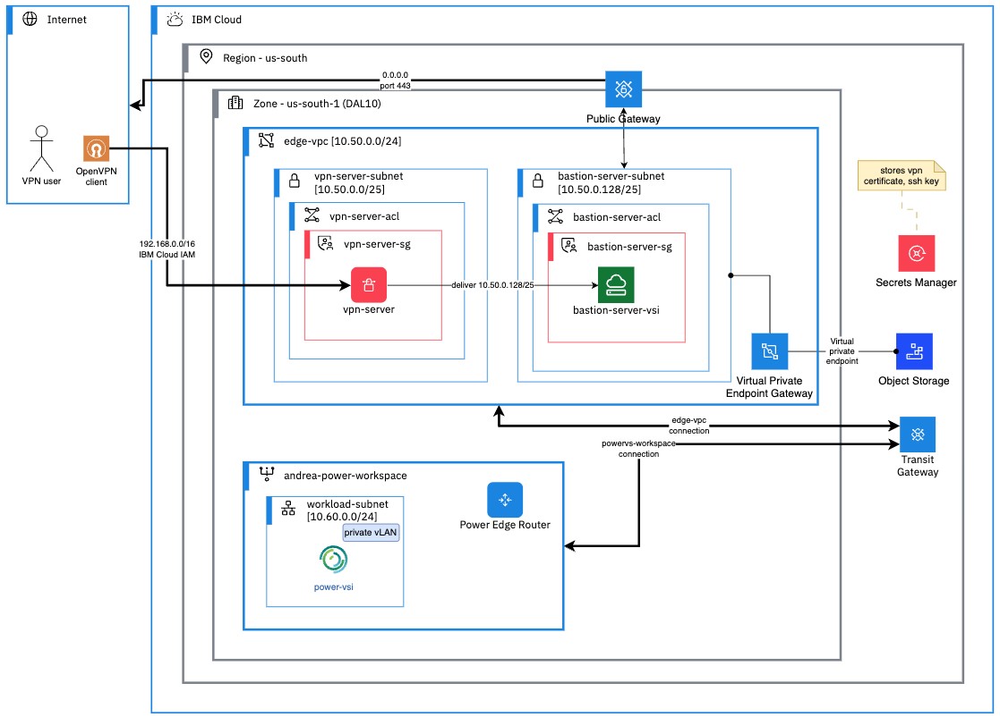

# Part 3 (public): Connect Cloud Object Storage to the PowerVS environment

This branch is intended to help validate the changes in Part 3. The IBM Cloud CLI needs to be installed on the PowerVS instance, which sits in a private network. The IBM Cloud CLI must be downloaded from the Internet (https://github.com/IBM-Cloud/ibm-cloud-cli-release/releases). This branch provides the automation to use network ACLs, security groups and a public gateway to provide temporary access to the Internet from the bastion server ("jump" host).

The intended use is to deploy part3-public from Schematics, perform any public downloads on the bastion server, and then revert back to part3 to switch the networking back to prevent public traffic.

1. Update and run the Schematics Workspace
2. Run Schematics workspace
3. Examine the Schematics Workspace
4. Validate the provisioned environment

