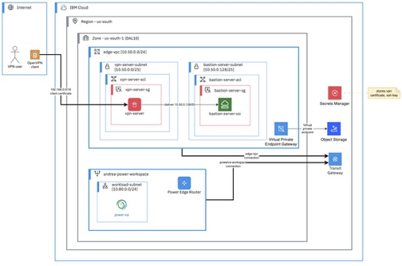

# Part 1: Provision a PowerVS environment

IBM Cloud Schematics is an infrastructure-as-code (IaC) service that enables users to automate the provisioning, configuration, and management of cloud resources using tools like Terraform, Ansible, and Helm. It provides a centralized and secure way to define cloud infrastructure as code, manage versioning, and enforce governance policies. Schematics integrates with IBM Cloud Identity and Access Management (IAM) for role-based access control and supports Git-based workflows for collaborative development. This makes it ideal for DevOps teams looking to streamline deployments and maintain consistency across environments.

1. Setup the IBM Cloud Schematics Workspace
2. Run Schematics Workspace
3. Examine the Schematics Workspace
4. Validate the IBM Cloud resources provisioned

